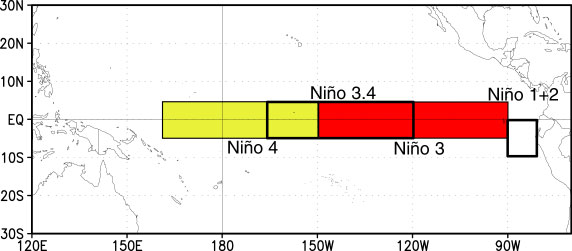

### Subsetting data in Space

Often in our research, we want to look at a specific region defined by a set of latitudes and longitudes. 

#### Conventional approach
We would have an array, like an `numpy.ndarray` with 3 dimensions, such as lat,lon,time that contains our data. We would need to write nested loops with `if` statements to find the indices of the latitudes and longitudes we are looking for and then extract out those data to a new array. 

This is slow, and has the potential for mistakes if we get the wrong indices. Our data and metadata are disconnected. 

`xarray` makes it possible for us to keep our data and metadata connected and select data based on the dimensions, so we can tell it to extract a specific lat-lon point or select a specific range of lats and lons using the `sel` function.

### Select a point

Let's try it for a point.  We will pick a latitude and longitude in the middle of the Pacific Ocean. 

~~~
ds_point=ds.sel(lat=0,lon=180,method='nearest')
ds_point
~~~
{: .language-python}

The `.sel` method is for selecting data by dimesion names and/or index labels. There are multiple ways of selecting subsets of data in `xarray` - see <a href="http://xarray.pydata.org/en/stable/user-guide/indexing.html">the online documentation</a> for a thorough discussion with examples.

Note that this DataSet has two data variables - the one we are interested in is `sst`. 
`xarray` allows you to apply many methods to entire Datasets that other programming languages would only permit on individual DataArrays.
This is a powerful feature, but can be cofusing - always think about the scope of any operation in Python when you apply it.

We could apply `sel` only to the `sst` DataArray instead of the entire Dataset:

~~~
da_point=ds.sel(lat=0,lon=180,method='nearest')
np.array_equal(da_point,ds_point['sst'])
~~~
{: .language-python}

The `numpy` function `array_equal` tests if two arrays have exactly the same dimensions and contents. 
You can see that the test is passed - the two appraches yield the same final result.

We now have a new `xarray.Dataset` with all the times and a single latitude and longitude point. All the metadata is carried around with our new `Dataset`.  We can plot this timeseries and label the x-axis with the time information.

~~~
plt.plot(ds_point['sst'])
~~~
{: .language-python}

Note the X-axis simply counts the 461 time steps.  
This is not very informative if we would like to know when a particular spike occurred. 
When `plt.plot` is given one series, it is assumed to be the values on the Y axis and the X axis is simply counted as the element number in the seroes.
We can give it two series - the first is then the values for the X-axis:

~~~
plt.plot(ds_point['time'],ds_point['sst'])
~~~
{: .language-python}

For `matplotlib.pyplot`, it is good to consult the [documentation](https://matplotlib.org/stable/api/_as_gen/matplotlib.pyplot.html), 
not just to learn the syntax for using a specific function, but also to see the possibilities that you may try.
There are a lot of creative options that you may not have considered originally.

### Select a Region

A common region to look at SSTs is the Niño3.4 region.  It is defined as 5S-5N; 170W-120W.

Our longitudes are defined by 0 to 360 (as opposed to -180 to 180), so we need to specify our longitudes consistent with that.  To select a region we use the `sel` command with `slice`

~~~
ds_nino34=ds.sel(lon=slice(360-170,360-120),lat=slice(-5,5))
ds_nino34
~~~
{: .language-python}

Notice that we have no latitudes, what happened?
Our data has latitudes going from North to South, but we sliced from South to North.  This results in `sel` finding no latitudes in the range.  There are two options to fix this: (1) we can slice in the direction of the latitudes `lat=slice(5,-5)` or (2) we can reverse the latitudes to go from South to North.  

Let's reverse the latitudes.

~~~
ds=ds.reindex(lat=list(reversed(ds['lat'])))
~~~
{: .language-python}

This line reverses the latitudes and then tells `xarray` to put them back into the latitude coordinate.  But, since `xarray` keeps our metadata attached to our data, we can't just reverse the latitudes without telling `xarray` that we want it to attach the reversed latitudes to our data instead of the original latitudes. That's what the `reindex` function does. 

Now we can slice our data from 5S to 5N
~~~
ds_nino34=ds.sel(lon=slice(360-170,360-120),lat=slice(-5,5))
ds_nino34
~~~
{: .language-python}

Now, let's plot our data

~~~
plt.contourf(ds_nino34['lon'],ds_nino34['lat'],
             ds_nino34['sst'][0,:,:],cmap='RdBu_r')
plt.colorbar()
~~~
{: .language-python}

Note that the plot fills the available area - it is not in the _shape_ of the actual Niño3.4 region but has been stretched along the Y-axis. There are ways to control plot shapes and positions - we will talk about them later in the course.

Also, there are many options for colormaps.
See [this page](https://matplotlib.org/stable/tutorials/colors/colormaps.html) for inspiration.

### Time Slicing

Sometimes we want to get a particular time slice from our data.  Perhaps we have two datasets and we want to select the time slice that is common to both.  In this dataset, the data start in Dec 1981 and end in Apr 2020.  Suppose we want to extract the times for which we have full years (e.g, Jan 1982 to Dec 2019.  We can use the `sel` function to also select time slices. Let's select only these times for our `ds_nino34` dataset.

~~~
ds_nino34=ds_nino34.sel(time=slice('1982-01-01','2019-12-01'))
ds_nino34
~~~
{: .language-python}

> ## Writing data to a file
>
> In this case the dataset is small, but saving off our intermediate datasets is a common step
> in climate data analysis.  This is because our datasets can be very large so we may not
> want to wait for all our analysis steps to run each time we want to work with this data.
> We can write out our intermediate data to a file for future use.
>
> It is easy to write an `xarray.Dataset` to a netcdf file using the `to_netcdf()` function.
>
> Write out the ds_nino34 dataset to a file in your /scratch directory, like this (replace my username with yours):
> ~~~
> ds_nino34.to_netcdf('/scratch/kpegion/nino34_1982-2019.oisstv2.nc')
> ~~~ 
> {: .language-python}
>
> Bring up a terminal window in Jupyter and convince yourself that the file was written and the metatdata 
> is what you expect by using `ncdump`
>
{: .callout}



