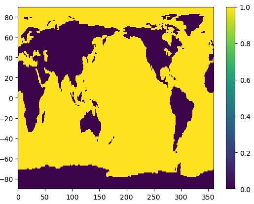
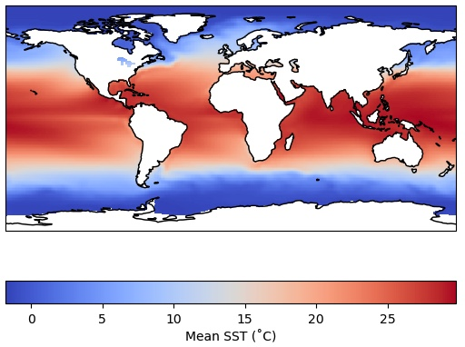
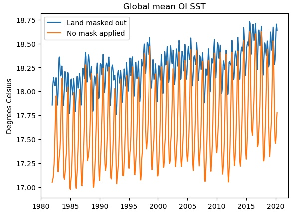

Sometimes we want to maskout certain data, for instance, based on a land/sea mask that is provided. 
The OISST dataset we have been using oddly shows data over land too - how could that be SST?

Let's create a notebook named `Masking.ipynb` and add our standard set of import statements to the first code cell:

~~~
import xarray as xr
import numpy as np
import cartopy.crs as ccrs
import matplotlib.pyplot as plt
~~~
{: .language-python}

Create a new markdown cell for this episode:

~~~
## Masking
~~~
{: .language-python}

Read in this dataset:

~~~
obs_file = '/home/pdirmeye/classes/clim680_2022/OISSTv2/monthly/sst.mnmean.nc'
ds_obs = xr.open_dataset(obs_file)
ds_obs
~~~
{: .language-python}

This is the original SST data file we read in last time. Let's plot the time mean again here, so we remember how it looks.

~~~
plt.contourf(ds_obs.lon,ds_obs.lat,ds_obs['sst'].mean('time'),cmap='coolwarm')
plt.colorbar()
~~~
{: .language-python}

Next let's read in a second file.

~~~
mask_file = '/home/pdirmeye/classes/clim680_2022/OISSTv2/lmask/lsmask.nc'
ds_mask = xr.open_dataset(mask_file)
ds_mask
~~~
{: .language-python}

Let's look at this second file.  It contains a lat-lon grid that is the same as our SST data, but a single time.  The data are 0's and 1's.  Plot it.

~~~
plt.contourf(ds_mask['mask'])
~~~
{: .language-python}

What does this error mean? 
The data has a *degenerate* time dimension with a single element and coordinate so the array appears as 3-D to the plotting function.  
We can drop any singular dimensions like this using the `squeeze` method:

~~~
ds_mask = ds_mask.squeeze()
plt.pcolormesh(ds_mask['mask'])
~~~
{: .language-python}

We have used a different plotting function.
* `countourf` plotted a discrete set of colors at contour intervals along smooth curves.
* `pcolormesh` plots filled grid cells matching the resolution of the data, but using a more continuous color scale.

The latitudes are upside down.  We could fix that like we did before. However, if we use the latitudes as the Y-coordinate parameter, it will reorient the plot automatically:

~~~
plt.pcolormesh(ds_mask.lon,ds_mask.lat,ds_mask['mask'])
plt.colorbar()
~~~
{: .language-python}

That's better! We can see that the mask data are 1 for ocean and 0 for land. 
We can use the `where` method in `xarray` to mask the data to only over the ocean.

~~~
da_ocean = ds_obs['sst'].mean('time').where(ds_mask['mask']==1)

ax = plt.axes(projection=ccrs.PlateCarree())
cs = ax.pcolormesh(da_ocean.lon,da_ocean.lat,da_ocean,cmap='coolwarm',
                 transform = ccrs.PlateCarree())
cbar = plt.colorbar(cs,orientation='horizontal',label='Mean SST (˚C)') 
ax.coastlines() 
~~~
{: .language-python}

Recall that we could have achieved the same blanking out of the land areas by using the `feature` 
interface in `cartopy` to paint over the temperature values over the continents. 
But those land values are still there in the array.

There are often instances where we truly want to remove data from an array using a mask, like we did above over land. 
Let's calculate a time series of global SST that only includes the ocean grid cells, none of the data over land.
Furthermore, let's apply area weighting like we showed previously:

~~~
weights = np.cos(np.deg2rad(ds_mask.lat))
unmasked = ds_obs['sst'].weighted(weights).mean(dim=['lon','lat'])
masked = ds_obs['sst'].where(ds_mask['mask']==1).weighted(weights).mean(dim=['lon','lat'])
~~~
{: .language-python}

We have also calculated an _unmasked_ version of the time series for comparison. 

Notice a couple of things about the cell above:
1. We have chained together multiple operations as a string of methods - they are executed in order from left to right on each line.
2. We had to apply the masking operation (the `where` method) before we generated the 
weighted array object with the `weighted` method - the sequence of operations often matters and
will produce an error or the wrong result if not applied in the correct (logical) sequence. 
Think carefully about *what makes sense* when you are doing complex calculations.

Let's plot the results:

~~~
plt.plot(masked.time,masked,label='Land masked out')
plt.plot(unmasked.time,unmasked,label='No mask applied')
plt.title('Global mean OI SST')
plt.ylabel('Degrees Celsius')
plt.legend()
~~~
{: .language-python}

If we do not mask out the land points (orange curve), the seasonal cycle is much stronger and there is a cold bias, 
probably due to the inclusion of the large high-latitude land areas of Antarctica, Eurasia and North America.
Only the blue curve shows the true "SST" global mean.

We also used some other features in plotting: specifying a `label` for each instance of `plt.plot` allows us
to generate the legend automatically. Also, we have labeled the Y-axis and applied a title to our plot.

> ## Finding help for `xarray`
>
> The `xarray` [documentation](http://xarray.pydata.org/en/stable/api.html) is also worth bookmarking. 
> Keep in mind that in Python there is usually a very simple and straightforward function or library 
> that will do anything you want to do.
> Often the trick is discovering the right function!
> Web searches can be very helpful. 
>
> In particular, most questions you might have are already answered by someone on 
> [Stack Overflow](https://stackoverflow.com), which is an open forum for programming questions and answers. 
> However, the quality of the answers varies - always try to understand any appropriate-looking answer before relying on it. 
> Use Stack Overflow and other online resources as *learning tools*, not a *crutch*!
>
{: .callout}
